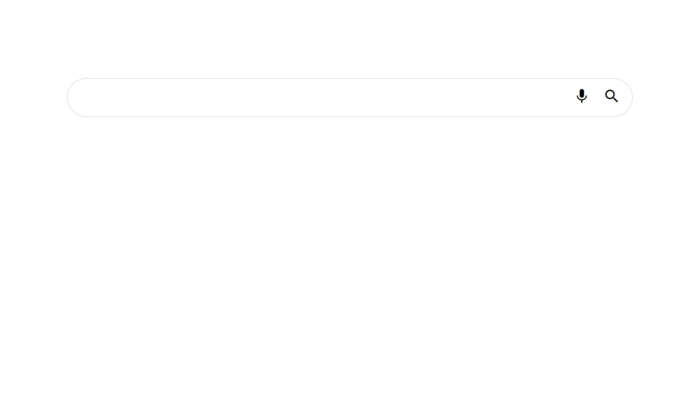

# Basic Header

This is a search bar in this project I use HTML, CSS and Material Icons

# Screen Project



# HTML
```html
<!DOCTYPE html>
<html lang="es">
<head>
    <meta charset="UTF-8">
    <meta http-equiv="X-UA-Compatible" content="IE=edge">
    <meta name="viewport" content="width=device-width, initial-scale=1.0">
    <link rel="stylesheet" href="styles.css">
    <title>Search Bar</title>
    <link href="https://fonts.googleapis.com/icon?family=Material+Icons"
      rel="stylesheet">
      <link rel="shortcut icon" href="charizard.png" type="image/x-icon">
</head>
<body>
    <div class="search-bar">
        <input type="text">
        <div class="actions">
            <button><span class="material-icons">mic</span></button>
            <button><span class="material-icons">search</span></button>
        </div>
    </div>
</body>
</html>
```

```sh
git clone https://github.com/asalinasf/search-bar/
cd search-bar
open in your browse
```

# CSS
```css
body{
    margin: 0;
    padding: 0;
    font-family: sans-serif;
    box-sizing: border-box;
}
a{
    color: white;
    text-decoration: none;
}
header{
    background-color: #202020;
    display: flex;
    justify-content: space-evenly;
    align-items: center;
    padding: 10px;
}
.logo img{
    padding-top: 7px;
    height: 50px;
    align-items: center;
}
.logo{
    display: flex;
    padding-right: 60px;
}
nav a{
    font-weight: 600;
    padding-right: 12px;
}
nav a:hover{
    color:yellow;
}
@media(max-width: 680px){
    header{
        flex-direction: column;
    }
    nav{
        padding: 10px 0px;
    }
}
```
# Visit my project with this url

https://aaronsalinasbarra.netlify.app/
